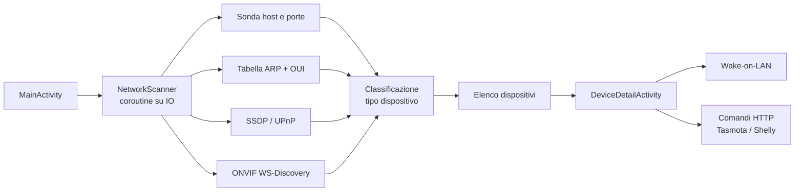

# NetHome Controller 📡

> App Android che **scansiona la rete di casa o dell'ufficio**, riconosce i dispositivi (router, PC, telecamere, stampanti, media player, prese smart) e permette di **accenderli o comandarli** dal telefono.

[](LICENSE)

-3DDC84)

**Stato:** prototipo funzionante · **Autore:** Gaspare Pettinati

---

## Cosa fa
- **Scansione della sottorete Wi‑Fi** con avanzamento in tempo reale e aggiornamento "tira per ricaricare".
- **Riconoscimento dei dispositivi** combinando più tecniche:
  - porte aperte (es. RTSP 554/8554 → telecamera, 9100 → stampante, 8008/8009 → media player);
  - tabella ARP per gli indirizzi MAC e **produttore** ricavato dal prefisso OUI;
  - **SSDP / UPnP** per i dispositivi multimediali e domotici;
  - **ONVIF WS-Discovery** per le telecamere IP.
- **Scheda del dispositivo** con IP, MAC, produttore e porte, apertura del pannello web.
- **Wake-on-LAN**: accende un PC dalla rete con il "magic packet".
- **Prese e relè smart**: comando on/off per dispositivi **Tasmota** e **Shelly** via HTTP locale.

Tutto avviene **in rete locale**: nessun server esterno e nessun account.

## Come funziona



## Stack
| Livello | Tecnologie |
|---|---|
| Linguaggio | Kotlin 2.1, coroutine |
| UI | AndroidX, Material Components, RecyclerView, ViewBinding |
| Rete | socket TCP/UDP, multicast (SSDP, WS-Discovery), ARP |
| Build | Gradle, compileSdk 35, minSdk 24 |

## Struttura

```
app/src/main/java/com/nethome/controller/
  MainActivity.kt           scansione, permessi, multicast lock, elenco
  NetworkScanner.kt         sonda host/porte, ARP, SSDP, ONVIF, classificazione
  OuiVendors.kt             produttore dal MAC (prefisso OUI)
  WakeOnLan.kt              magic packet
  DeviceDetailActivity.kt   scheda dispositivo e comandi
  Device.kt / DeviceAdapter.kt
```

## Compilare l'app
1. Apri la cartella con **Android Studio** (Ladybug o successivo).
2. Lascia che Gradle sincronizzi il progetto (il wrapper viene generato da Android Studio se manca).
3. Avvia su un telefono collegato alla **stessa rete Wi‑Fi** dei dispositivi.

### Permessi
L'app chiede la **posizione** (o "dispositivi Wi‑Fi nelle vicinanze" su Android 13+) perché Android la richiede per leggere le informazioni della rete Wi‑Fi. La posizione non viene usata né salvata.

## Uso responsabile
Scansiona solo reti **tue** o per cui hai l'autorizzazione.

---

**Licenza:** [MIT](LICENSE) · **Contatti:** [gasparepettinati.it](https://gasparepettinati.it) · info@gasparepettinati.it
